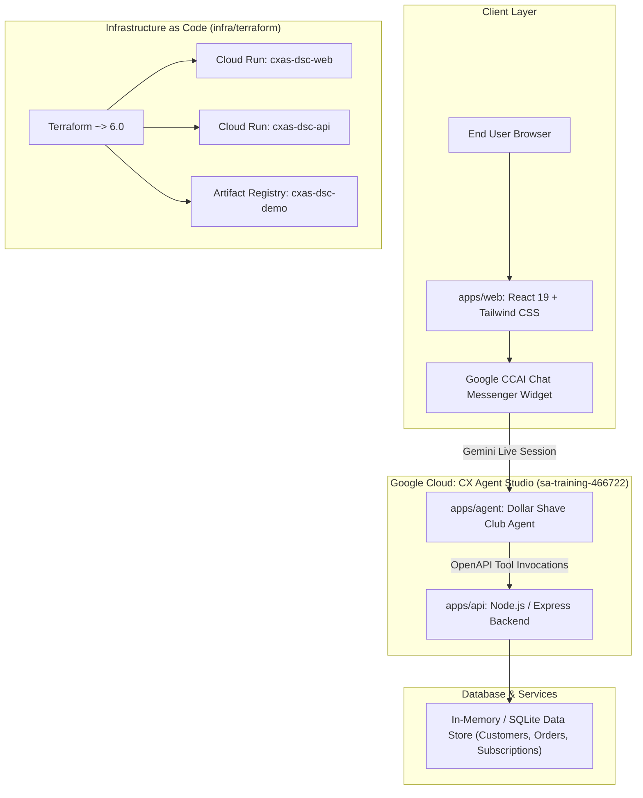

# Dollar Shave Club Monorepo (CX Agent Studio & Full-Stack Application)

A production-grade monorepo containing a full-stack Dollar Shave Club demo platform powered by **Google CX Agent Studio (Gemini Enterprise CX)**, complete with frontend storefront, backend database and API, declarative virtual agent specifications, spend-gated test suites, and Terraform infrastructure.

> [!NOTE]
> **Never confuse CX Agent Studio with Dialogflow ES or CX.** CX Agent Studio is built on the Google Customer Engagement Suite (CES) powered by Gemini Live models and declarative instructions/tools.

---

## Monorepo Architecture & System Topology



---

## Workspace Layout

| Directory | Workspace | Description | Technology |
| :--- | :--- | :--- | :--- |
| `apps/web` | `@dsc/web` | Dollar Shave Club storefront & chat widget | React 19, TypeScript, Vite, Tailwind CSS v4, Lucide Icons |
| `apps/api` | `@dsc/api` | Customer service API, database lookup/mutations & OpenAPI 3.0 specs | Node.js, Express, TypeScript, Vitest |
| `apps/agent` | `@dsc/agent` | CX Agent Studio specifications, OpenAPI tools, golden tests & scenarios | Google CES (`ces.googleapis.com`), Gemini 3.1 Flash Live |
| `infra/terraform` | N/A | Infrastructure as code for Cloud Run, Artifact Registry, IAM | HashiCorp Terraform ~> 6.0 |

---

## Supported Customer Scenarios

The system implements 3 end-to-end customer care workflows:

1. **Alex Vance (`alex@example.com`)**:
   - **Order Tracking**: Looks up order `DSC-8832` via database (carrier `UPS`, tracking `1Z99999999999999`, arriving tomorrow by 8 PM).
   - **Restock Box Cadence**: Clarifies Starter Set trial schedule (first full-size box billed 2 weeks later to prevent running out of blades; regular bi-monthly cadence afterwards); delays upcoming bill date before October 15.
2. **Jamie Cole (`jamie@example.com`)**:
   - **Lost Package Detection**: Looks up order `DSC-9104`, detects carrier scan gap (>4 days), and authorizes an immediate free replacement.
   - **Address Update**: Updates database shipping address to `123 Main St, Austin TX 78701` for the replacement and all future boxes.
3. **Chris Wright (`chris@example.com`)**:
   - **Damaged Item Replacement**: Replaces exploded Shave Butter in shipment `DSC-7721` free of charge (ships in 24h).
   - **Secure Payment Card Update**: Urgent billing scheduled for tomorrow. Enforces strict zero credit cards in chat security policy; dispatches secure Shop Pay link via SMS and email.

---

## Single Root Commands (Monorepo Best Practice)

All commands are executed directly from the monorepo root:

| Command | Action | Financial Cost |
| :--- | :--- | :--- |
| `npm test` | Run all unit, integration, and scenario validations across all workspaces locally | **$0.00 (Zero Spend)** |
| `npm run build` | Build all workspace packages for production (`tsc`, `vite build`, `validate_specs`) | **$0.00 (Zero Spend)** |
| `npm run test:eval` | Run offline CX Agent Studio scenario & golden test validation | **$0.00 (Zero Spend)** |
| `npm run eval:remote` | Remote live session evaluator strictly guarded by spend gate | **$0.50 / session (Requires user approval)** |
| `npm run sync:agent` | Deploy declarative `agent.yaml` instructions to Google CX Agent Studio via CES API | **$0.00** |
| `npm run dev` | Start development servers across workspaces | **$0.00** |
| `npm run tf:plan` | Preview Terraform infrastructure deployment | **$0.00** |
| `npm run tf:apply` | Provision Artifact Registry and Cloud Run services | GCP hosting |
| `npm run tf:destroy` | Completely tear down all demo infrastructure on GCP | **$0.00** |

---

## CX Agent Studio Testing & Spend Gate

> [!CAUTION]
> **Live sessions against CX Agent Studio cost $0.50 per session.**
> Autonomous agents and engineers are strictly forbidden from initiating live sessions without prior explicit business approval from the user.

### Offline Evaluation ($0.00 Spend)
Execute the offline test suite at zero cost:
```bash
npm run test:eval
```
Validates all declarative specifications, OpenAPI tool schemas, turn alternation, and golden intent assertions in <1 second with 100% offline local execution.

### Remote Session Evaluation (Spend Gated)
```bash
npm run eval:remote
```
Outputs the planned session count and total calculated spend (e.g. `9 sessions * $0.50 = $4.50 USD`) and safely exits unless `CXAS_SPEND_APPROVED=true` has been explicitly authorized by the user.

---

## Autonomous Governance & Mistake Immunity

- Operating principles and technical roles are documented in [AGENTS.md](file:///Users/shawn.faherty@ttecdigital.com/Code/cxas-agy-dsc-demo/AGENTS.md).
- Institutional memory and edge-case mitigations are maintained in [docs/learnings.md](file:///Users/shawn.faherty@ttecdigital.com/Code/cxas-agy-dsc-demo/docs/learnings.md).
- Releases follow Conventional Commits and automated versioning via `release-please`.
