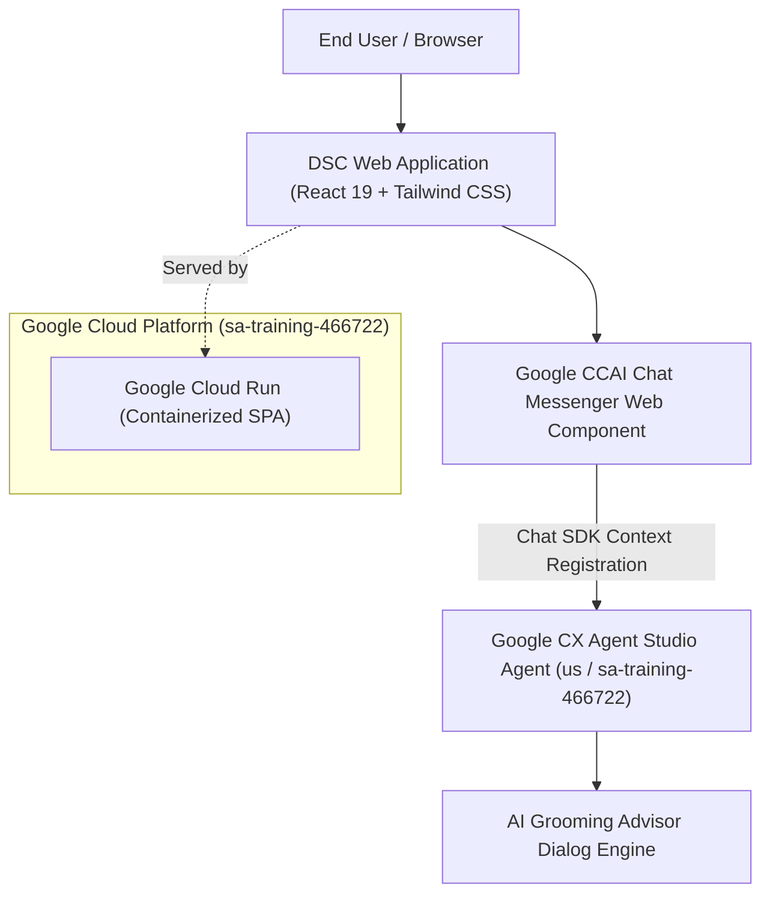

# Dollar Shave Club Webchat Demo (CX Agent Studio)

A production-grade web experience demonstrating conversational AI integration with Google Cloud CX Agent Studio (CCAI), styled to represent the Dollar Shave Club (DSC) brand.

---

## Architecture & System Design



### Stack Components
- **Frontend**: React 19, TypeScript, Vite, Tailwind CSS v4, Lucide Icons.
- **Component Styling**: Clean, accessible shadcn/ui design patterns with Dollar Shave Club brand palette (slate/navy `#0f172a`, amber `#ea580c`, warm stone `#fafaf9`).
- **Conversational AI**: Google CCAI / CX Agent Studio chat messenger embedded custom elements:
  - Deployment: `projects/137470913560/locations/us/apps/82a19631-fe39-40fa-a593-60778d958407/deployments/93ef4da3-d0a5-4db9-b686-cb0f5a2537fb`
- **Container & Hosting**: Multi-stage `Dockerfile`, zero-dependency production static server (`server.js`), Google Cloud Run.
- **Testing**: Vitest + React Testing Library (local-first execution).
- **Release Automation**: `release-please` for automated semantic versioning and changelogs.

---

## Autonomous Governance & Operating Principles

This repository operates under strict autonomous engineering principles documented in [AGENTS.md](file:///Users/shawn.faherty@ttecdigital.com/Code/cxas-agy-dsc-demo/AGENTS.md):
- **100% Technical Ownership**: The autonomous team assumes complete PM, Architect, Engineer, QA, and Technical Writer responsibilities.
- **Local-First Testing**: All test suites are executed locally (`npm test`, `npm run build`) to preserve CI workflow limits.
- **GitHub as Single Source of Truth**: All epics, features, bugs, and spikes are tracked via GitHub Issues.
- **Mistake Immunity**: Permanent learnings and anti-patterns are recorded in [docs/learnings.md](file:///Users/shawn.faherty@ttecdigital.com/Code/cxas-agy-dsc-demo/docs/learnings.md).
- **Workspace Skills**:
  - `build-feature`: Feature development standards.
  - `bug`: Defect diagnosis, reproduction, and resolution.
  - `spike`: Timeboxed architectural investigations.
  - `cxas-testing`: Spend-gated CX Agent Studio testing.

---

## CX Agent Studio Testing & Spend Protocol

> [!CAUTION]
> **Live sessions against CX Agent Studio cost $0.50 per session.**
> Autonomous agents and engineers are strictly prohibited from initiating live sessions without prior explicit business approval from the user.

### Offline Test Authoring ($0 Spend)
Test cases are authored and validated offline at zero cost:
- **Golden Tests**: [`cxas/golden/golden_tests.json`](file:///Users/shawn.faherty@ttecdigital.com/Code/cxas-agy-dsc-demo/cxas/golden/golden_tests.json) (5 core intent and parameter validation cases).
- **Scenario Tests**: [`cxas/scenarios/scenarios.json`](file:///Users/shawn.faherty@ttecdigital.com/Code/cxas-agy-dsc-demo/cxas/scenarios/scenarios.json) (Multi-turn recommendation & subscription pause flows).

### Running Offline Validation & Cost Gate
```bash
node cxas/scripts/validate_and_run.js
```
The script validates the test schemas and outputs the exact session count and financial spend requirement before terminating safely unless `CXAS_SPEND_APPROVED=true` is present.

---

## Local Development & Commands

### 1. Install Dependencies
```bash
npm install
```

### 2. Run Local Development Server
```bash
npm run dev
```
Accessible at `http://localhost:3000`.

### 3. Run Local Test Suite
```bash
npm test
```

### 4. Build Production Bundle
```bash
npm run build
```

---

## Deployment to Google Cloud Run

The application is containerized with a lightweight multi-stage Docker build.

To deploy to Cloud Run in `sa-training-466722`:
```bash
./scripts/deploy.sh
```
Or via gcloud directly:
```bash
gcloud run deploy cxas-dsc-demo \
  --source . \
  --project sa-training-466722 \
  --region us-central1 \
  --allow-unauthenticated \
  --port 8080
```
