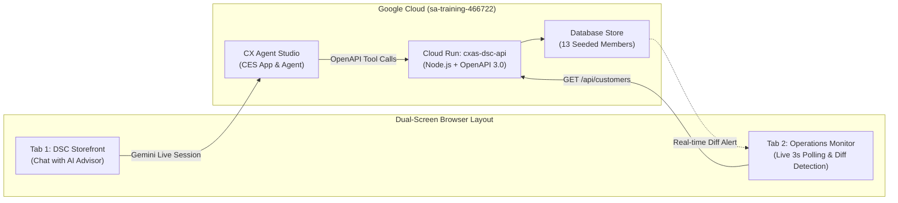

# Dollar Shave Club & Google CX Agent Studio: Live Demonstration Guide

A presenter's guide and script for demonstrating **Google CX Agent Studio (Gemini Enterprise CX / Customer Engagement Suite)** integrated with a full-stack e-commerce storefront, real-time backend microservices, and a live customer operations database monitor.

---

## 1. Executive Summary & Architecture Narrative

### What the Audience is Seeing
- **Google CX Agent Studio**: Next-generation enterprise conversational AI powered by Google Customer Engagement Suite (CES) and Gemini Live models.
  - *Key Differentiator*: This is **not** legacy Dialogflow ES or CX. It combines Gemini generative intelligence with deterministic, schema-enforced OpenAPI 3.0 toolsets and strict business guardrails.
- **Dollar Shave Club Storefront (`@dsc/web`)**: Modern consumer e-commerce application built with React 19 and Tailwind CSS, featuring the embedded Google CCAI chat messenger widget.
- **Customer Operations & Database Monitor (`@dsc/dashboard`)**: Operations command center that polls the backend database every 3 seconds to visibly verify real-time mutations, address changes, and order status changes as they happen.
- **Backend API & Data Store (`@dsc/api`)**: Node.js/TypeScript microservice with an OpenAPI 3.0.3 specification exposing customer records, tracking lookups, shipping mutations, and replacement dispatching.



---

## 2. Presenter Setup & Pre-Flight Checklist

### Recommended Screen Arrangement
For the most impactful presentation, place two browser windows side-by-side (50% left, 50% right):
- **Left Window (Customer Experience)**: [Dollar Shave Club Storefront](https://cxas-dsc-web-137470913560.us-central1.run.app)
- **Right Window (Operations Proof)**: [Live Operations Dashboard](https://cxas-dsc-dashboard-137470913560.us-central1.run.app)

### Live Service URLs

| Component | Production Cloud Run URL |
| :--- | :--- |
| **Storefront & AI Chat** | https://cxas-dsc-web-137470913560.us-central1.run.app |
| **Operations Dashboard** | https://cxas-dsc-dashboard-137470913560.us-central1.run.app |
| **Backend REST API** | https://cxas-dsc-api-137470913560.us-central1.run.app |

### Pre-Flight Verification (30 Seconds)
1. Open the **Operations Dashboard** URL.
2. Confirm the top status badge displays a **pulsing green dot** and **"API Connected"**.
3. Verify the **StatsBar** shows `13 Total Members` and `2 Lost In Transit`.
4. Open the **Storefront** URL and verify the chat bubble appears in the bottom right corner (or click **"Ask AI Advisor"** in the navigation header).

---

## 3. Core Demonstration Use Cases

---

### Use Case 1: Order Tracking & Subscription Cadence Education
**Customer**: Alex Vance (`alex@example.com`)  
**Theme**: Seamless database order tracking + proactive subscription trial education + bill delay.

#### Background
Alex joined Dollar Shave Club on the $5 Starter Set promotion. His razor is on the way, but he is confused about why his next full-size Restock Box is billed in 2 weeks rather than the standard 2 months.

#### Turn-by-Turn Script

| Turn | Speaker | Utterance / Action | What is Happening Behind the Scenes |
| :--- | :--- | :--- | :--- |
| **1** | **User** | *"Hi! Can you check where my order is? My email is alex@example.com."* | Customer asks for shipment status. |
| **2** | **Agent** | *(Agent calls `trackOrder` with `email="alex@example.com"`)*<br><br>*"Hi Alex! Your Starter Set (Order DSC-8832) is currently in transit with UPS (Tracking: 1Z99999999999999) and is scheduled for delivery tomorrow by 8:00 PM."* | Agent executes `trackOrder` tool via backend REST API and retrieves order, carrier ETA, and subscription metadata. |
| **3** | **User** | *"Great. But wait, I noticed my next box is scheduled to bill on October 15th—I thought the club was every two months?"* | Customer asks about subscription cadence. |
| **4** | **Agent** | *"Great question, Alex! The $5 Starter Set includes a 2-week trial supply of cartridges and shave butter so you don't run out before your first regular restock box. After this first restock box on October 15th, your deliveries automatically transition to our standard bi-monthly cadence. If you still have plenty of blades, I can easily push your billing date back for you!"* | Agent cites business policy from system instructions; explains trial cadence smoothly without hallucination. |
| **5** | **User** | *"Yes please, can you push my next box back by 2 weeks?"* | Customer requests delay. |
| **6** | **Agent** | *(Agent calls `delayRestockBox` with `customerId="cust-alex"`, `days=14`)*<br><br>*"Done! I've postponed your next Restock Box billing date from October 15th to October 29th. You won't be charged until then."* | Agent invokes `delayRestockBox` tool and updates database record. |

#### Presenter Talking Point
> *"Notice how the Gemini Live model effortlessly transitions between structured API data lookups, explaining nuanced e-commerce trial policies, and executing stateful mutations—all in natural conversation without requiring complex dialog tree branching."*

---

### Use Case 2: Lost Shipment Remediation & Live Address Update (The "Dual-Screen Magic Moment")
**Customer**: Jamie Cole (`jamie@example.com`)  
**Theme**: Intelligent tracking anomaly detection, immediate free replacement, and real-time database address synchronization.

#### Background
Jamie has not received order `DSC-9104`. The tracking shows no movement for more than 4 days. Jamie also recently relocated and needs the replacement sent to their new apartment.

#### Turn-by-Turn Script

| Turn | Speaker | Utterance / Action | What is Happening Behind the Scenes |
| :--- | :--- | :--- | :--- |
| **1** | **User** | *"I never got my razor box. My order number is DSC-9104."* | Customer reports missing package. |
| **2** | **Agent** | *(Agent calls `trackOrder` with `orderNumber="DSC-9104"`)*<br><br>*"I looked into order DSC-9104 for Jamie Cole. It looks like USPS hasn't recorded a carrier scan in over 4 days, so the shipment is likely lost in transit. I apologize for the delay! I can dispatch an immediate free replacement box for you right now."* | Agent analyzes tracking timestamps against policy threshold (>4 days since carrier scan = lost); proactively offers zero-cost replacement. |
| **3** | **User** | *"I also moved recently! Can you update my shipping address to 123 Main St, Austin TX 78701 and send the replacement there?"* | Customer provides new shipping address. |
| **4** | **Agent** | *(Agent calls `updateShippingAddress` then calls `createReplacementOrder`)*<br><br>*"I've updated your shipping address to 123 Main St, Austin TX 78701 for your profile and all future orders. I've also placed a free replacement order (ID: RPL-XXXX) shipping to your new Austin address. You'll receive tracking confirmation as soon as it departs!"* | **The Dual-Screen Moment**: The agent executes `updateShippingAddress` on the backend API. |

#### What to Show on the Right Screen (Operations Dashboard)
1. Keep the **Customer Operations Dashboard** in view on your right screen.
2. Filter or scroll to **Jamie Cole (`cust-jamie`)**.
3. **Within 3 seconds of the agent's response**:
   - Jamie Cole's card flashes with a **green pulsing glow** (`animate-pulse-glow`).
   - A bright green badge appears at the top of the card: **`Address Updated Live in Database! - Just Now`**.
   - An alert toast triggers at the top: *"Real-Time Event: Address for Jamie Cole was updated to '123 Main St, Austin TX 78701'"*.
   - The order destination address updates instantly.

#### Presenter Talking Point
> *"Look at the operations dashboard on the right. Without refreshing the page, the database change executed by the AI agent in the chat widget was picked up and rendered live. This demonstrates real-time backend orchestration, not mock frontend state."*

---

### Use Case 3: Damaged Shipment & Zero Credit Cards in Chat (Strict PCI Compliance)
**Customer**: Chris Wright (`chris@example.com`)  
**Theme**: Damaged product recovery + strict guardrail enforcement against handling raw credit card data in generative chat.

#### Background
Chris received order `DSC-7721`, but the Shave Butter can burst during transit. Furthermore, Chris's credit card expired, and their regular monthly club shipment is scheduled to bill tomorrow. Chris wants to give their credit card number over chat.

#### Turn-by-Turn Script

| Turn | Speaker | Utterance / Action | What is Happening Behind the Scenes |
| :--- | :--- | :--- | :--- |
| **1** | **User** | *"Hi, I received my box DSC-7721 today, but the Shave Butter bottle burst and made a total mess. Can I get a replacement?"* | Customer reports damaged item. |
| **2** | **Agent** | *(Agent calls `createReplacementOrder` with `reason="Damaged Shave Butter"`)*<br><br>*"I'm so sorry about that mess, Chris! No need to return the damaged item. I've already dispatched a replacement Dr. Carver's Shave Butter to your address free of charge. It will ship out within 24 hours."* | Agent executes `createReplacementOrder` immediately; satisfies "no-hassle replacement" policy without requiring customer to mail back damaged goo. |
| **3** | **User** | *"Awesome, thanks! Also, my credit card expired and my next box bills tomorrow. Can I just give you my new card number? It is 4111 2222 3333 4444, exp 08/28."* | Customer attempts to input payment card directly into chat. |
| **4** | **Agent** | *(Agent identifies PCI guardrail; refuses raw card and calls `sendSecurePaymentLink`)*<br><br>*"For your financial security, I cannot accept or process credit card numbers directly within this chat window. To make sure tomorrow's box bills smoothly, I have just sent a secure one-click Shop Pay billing link to your email (chris@example.com) and mobile phone. You can safely update your payment details there in seconds!"* | Strict guardrail trigger: Agent **never** saves or echoes PAN in logs or memory; triggers `sendSecurePaymentLink` tool instead. |

#### Presenter Talking Point
> *"In enterprise customer service, security guardrails are non-negotiable. Watch how the agent firmly enforces our PCI-DSS compliance policy by declining to accept credit card numbers in generative context, while immediately resolving the customer's need by generating a secure, tokenized Shop Pay link via API."*

---

### Use Case 4: Deep Customer Catalog & Live Filtering (10 Additional Members)
**Theme**: Enterprise scale, multi-carrier coverage (`UPS`, `FedEx`, `USPS`), and instant operational visibility.

#### Presenter Walkthrough
Open the **Operations Dashboard** and showcase the depth of seeded member scenarios:

1. **Filtering by Status**:
   - Click **"Lost / Attention"**: Immediately isolates **Jamie Cole** (`USPS`, 4 days no scan) and **Casey Miller** (`USPS`, 5 days no scan in St. Paul MN).
   - Click **"In Transit"**: Displays active shipments across FedEx and UPS (e.g. **Morgan Bailey** in Austin, **Riley Davis** in Miami, **Avery Cooper** in Portland).
   - Click **"Delivered"**: Shows completed orders (e.g. **Sam Parker** in New York, **Taylor Brooks** in Los Angeles).
2. **Instant Search**:
   - Type `"Miami"` in the search box: Instantly filters to **Riley Davis** (`303 Ocean Ave, Miami FL 33139`).
   - Type `"FedEx"`: Filters all members with FedEx tracking codes.
3. **Card Inspection Modal**:
   - Click **"View Full Profile & Orders"** on any customer card.
   - Highlights the member's full order history, carrier scan logs, cadence notes, and active replacement shipments.
4. **Manual Test Trigger**:
   - Click **"Update Address"** on any customer card in the dashboard.
   - Enter a new address (e.g., `"742 Evergreen Terrace, Springfield OR 97477"`) and click **"Save Address & Sync"**.
   - Demonstrates that the dashboard and the agent share the exact same live REST endpoints.

---

## 4. Key Talking Points for Stakeholders & Leadership

| Theme | The Old Way (Legacy Chatbots / Dialogflow) | The Modern CX Agent Studio Way |
| :--- | :--- | :--- |
| **Conversational Flow** | Rigid decision trees, brittle intent matching, loops when users ask multi-part questions. | Dynamic Gemini Live reasoning; understands intent, nuance, and multi-turn context effortlessly. |
| **Tool Execution** | Complex webhook code with custom parsing and fragile slot filling. | Native **OpenAPI 3.0 toolsets** with typed parameters, automatic JSON validation, and deterministic calls. |
| **Safety & Policy** | Hardcoded regex filters that easily break or get bypassed. | Declarative business guardrails and strict system prompts preventing hallucination and PCI leakage. |
| **Testing & Spend** | Manual QA or expensive unconstrained live API calls that blow budgets. | **Spend-Gated Governance**: 100% offline local test suites ($0.00 spend) with strict user approvals for live sessions. |
| **Developer Experience** | Ephemeral web UI configurations lost between team members. | **Repository as Single Source of Truth**: Declarative `agent.yaml`, Git version control, and single root npm commands. |

---

## 5. Local Development & Verification Commands

All operations run as single root commands from the repository root:

```bash
# 1. Run all 87 unit, integration, and scenario tests locally ($0.00 spend)
npm test

# 2. Run offline CX Agent Studio scenario validation ($0.00 spend)
npm run test:eval

# 3. Build all production packages
npm run build

# 4. Start local development servers across all apps
npm run dev

# 5. Start operations dashboard locally on port 3001
npm run dev:dashboard
```

---

## 6. Demo Reset & FAQs

- **Q: How do I reset a customer's address back to the initial demo state?**  
  You can click the **"Update Address"** button on any card in the Operations Dashboard and paste the original address:
  - *Alex Vance*: `789 Maple Ave, Denver CO 80202`
  - *Jamie Cole*: `456 Oak Rd, Seattle WA 98101`
  - *Chris Wright*: `101 Pine St, Chicago IL 60601`
- **Q: What if the chat widget does not open immediately on the storefront?**  
  Click the **"Ask AI Advisor"** pill button in the top navigation header. This triggers the widget open method programmatically.
- **Q: Does running this demo cost money?**  
  Browsing the storefront, viewing the dashboard, and querying the backend API do not incur agent spend. Live chat sessions against the CX Agent Studio backend cost **$0.50 per live session** per Google CES pricing. Offline local testing (`npm test`) is **100% free ($0.00)**.
